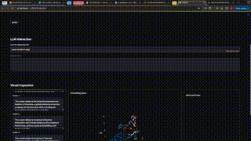

# RAG Visualizer

## Overview
This RAG Visualizer offers a comprehensive exploration of a 3D embedding space in an easy-to-distibute streamlit app. Utilizing DBSCAN for cluster identification, the visualizer employs the underlying LLM to describte the semanticis of these clusters. Users can interactively query chunks and visualize both the input prompt and the retrieved chunks. RAG Visualizer serves as a toy example for your LLMOps pipeline. RAG Visualizer enables a deep understanding of clusters, revealing meaningful patterns and enchancing interpretability.

<p align="center">
  
</p>


## Installation
1. Clone the repository to your local machine:
   ```bash
   git clone https://github.com/your-username/rag-visualizer.git
   ```
2. Navigate to the project directory:
    ```bash
    cd rag-visualizer
    ```
3. Install the required dependencies using pip:
    ```bash
    pip install -r requirements.txt
    ```
4. in `constants.py` change the HF_TOKEN variable with your specific token.
    ```python
    HF_TOKEN = 'YOUR_HF_TOKEN'
    ```
5. Run the RAG visualizer script:
    ```bash
    streamlit run app.py
    ```

## Additional Configuration

By default, Streamlit operates on port 8501. If deploying to the cloud, ensure explicit traffic allowance on port 8501 and use the external IP address of your instance in the format: `external_ip:8501`.

## Technical Stack
The current LLM is `meta-llama/Llama-2-7b-chat-hf` in 8bit format and embedding model is `sentence-transformers/all-MiniLM-L6-v2`. Therefore, your HF token will need to have access to the Llama2 models. You can use other LLMs. However, make sure to configure the system prompt for your given LLM. The query engine is [LlamaIndex](https://github.com/run-llama/llama_index) This app is optimized to run efficiently on a single Nvidia T4 GPU, ensuring reasonable response times. Take these considerations into account for a seamless deployment experience.

## License

This project is licensed under the MIT license.


